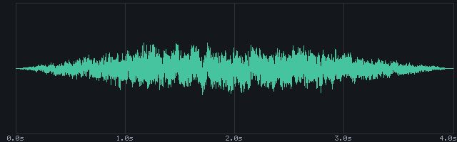
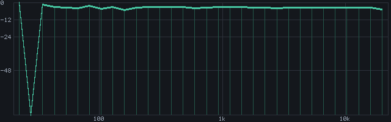
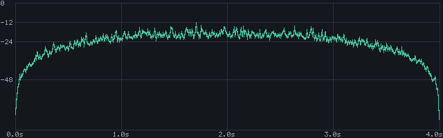

# 🦅 ReaClaw

[](https://github.com/braveness23/reaclaw/actions/workflows/ci.yml)
[](LICENSE)
[](https://github.com/braveness23/reaclaw/releases/latest)
[](#installation)

**Give your AI agent a real seat at the mixing desk.**

ReaClaw is a native C++ REAPER extension that embeds an HTTPS server *inside* REAPER and
exposes a clean REST/JSON API. Point any HTTP-capable AI agent at it — Claude, a local
LLM, a shell script — and it can build sessions, wire up routing, tweak FX, write
automation… and then **listen to the result and tell you what it just did to your mix.**

No bridge scripts. No GUI scraping. No external process. The extension runs in REAPER's
own process, so it has direct, first-class access to every single REAPER API call.

```bash
curl -sk -H "Authorization: Bearer sk_your_key" \
  https://localhost:9091/state | jq '.bpm, .tracks | length'
```

---

## 👂 The headline trick: the agent can hear itself

Most "AI controls a DAW" tools are flying blind — they fire commands and hope. ReaClaw
closes the loop. After an edit, the agent can **measure its own output** and even get a
**picture of the audio**, returned as a labelled PNG *alongside* a machine-readable digest
(the agent reads the numbers; the picture is for you).

These are real renders straight out of `GET /analysis/.../visualize` — no Photoshop, no
matplotlib, a dependency-free PNG encoder built into the extension:

| Waveform | Spectrum (EQ curve) | Loudness contour |
|:---:|:---:|:---:|
|  |  |  |
| peak / RMS / clip + envelope | 32 log-spaced bands + centroid | RMS over time, dB scale |

And the numbers behind them are *exact*, not guessed — loudness is computed by REAPER's
own offline full-decode (`CalculateNormalization`):

```jsonc
GET /analysis/item/0
{
  "loudness": {
    "lufs_i": -14.2, "rms_i": -16.8, "peak_db": -1.0, "true_peak_db": -0.7,
    "clipping": { "digital": false, "inter_sample": false },
    "method": "offline_analysis", "confidence": 1.0
  },
  "spectral": {
    "low": 0.21, "mid": 0.55, "high": 0.24, "centroid_hz": 2173.4,
    "method": "estimated_dsp", "confidence": 0.6
  }
}
```

Every number is tagged with a **`method`** (`offline_analysis` · `estimated_dsp` ·
`introspection` · `derived`) and a **`confidence`**, so the agent knows exactly how much
to trust each measurement.

---

## 🪝 It tells the agent what it just did

Blind automation is dangerous: an agent can happily arm a track that has no input, or send
audio into a muted bus, and never know. So **every mutating response carries a `hints[]`
array** — hand-authored, consequence-aware warnings surfaced inline:

```jsonc
POST /state/tracks/3   { "armed": true }
{
  "ok": true,
  "hints": [
    { "code": "recarm_no_input", "severity": "warn",
      "message": "Track armed for recording but has no record input assigned." },
    { "code": "solo_elsewhere", "severity": "info",
      "message": "Another track is soloed — this track will be silent on playback." }
  ]
}
```

`muted_track` · `solo_elsewhere` · `near_silent_fader` · `routes_nowhere` ·
`recarm_no_input` · `fx_offline` · `fx_bypassed` · `send_dest_muted` · `empty_item` ·
`midi_no_instrument` · `phase_inverted` … the agent finds out *before* you do.

---

## ⚡ What it can do

ReaClaw uses a **tiered coverage model**: typed structured verbs for everything you reach
for daily, a one-call action runner for REAPER's 65K-action catalog, and a Lua escape
hatch for the long tail. Ask `GET /capabilities` and the API tells you, honestly, what's a
first-class verb vs. what needs an action or a script.

| Area | You can… |
|---|---|
| 🎚️ **Tracks** | create / update / delete; name, color, folders, vol/pan/mute/solo/arm, phase, channels, pan mode, rec input, MIDI hw out, main send |
| 🎬 **Items & takes** | create (load audio/MIDI files), update, split, delete; take vol/pan/pitch/playrate/preserve-pitch; read source file/type/SR/channels |
| 🎛️ **FX** | add by name, get/set params (normalized *or* real units), bypass, **online/offline**, **copy/move between tracks**, load/step presets |
| 🔀 **Routing** | sends with vol/pan/mute/phase/mono and pre/post-fader mode |
| 📈 **Automation** | write envelope points (time, value, shape, tension), clear ranges |
| 🚩 **Markers & regions** | read / add / delete, with names and colors |
| 🥁 **Tempo & time** | full tempo/time-sig map read + write; beats↔seconds conversion |
| 🎯 **Selection** | select tracks *and* items (`[i,...]` / `"all"` / `"none"`) |
| 📝 **Project** | dirty flag, length, notes, and a persistent per-project ext-state scratchpad saved in the `.rpp` |
| ↩️ **Undo** | every structured edit lands as one clean, user-undoable step; `/undo` + `/redo` |
| 👂 **Perception** | loudness, spectral balance, live meters, hints, PNG visualizations (above), key/pitch/tempo probes, and named-surface screenshots |
| 🔭 **Catalog & scripts** | search 65K+ actions, run single actions or multi-step sequences, register validated Lua as native actions |

---

## 🚀 Quick start

```bash
# 1. Build it (see CONTRIBUTING.md) and drop the result in REAPER's UserPlugins:
#    Windows:  %APPDATA%\REAPER\UserPlugins\
#    macOS:    ~/Library/Application Support/REAPER/UserPlugins/
#    Linux:    ~/.config/REAPER/UserPlugins/

# 2. Minimal config at {REAPER_RESOURCE_PATH}/reaclaw/config.json
cat > config.json <<'JSON'
{
  "server": { "port": 9091 },
  "tls":    { "enabled": true, "generate_if_missing": true },
  "auth":   { "type": "api_key", "key": "sk_change_me" }
}
JSON

# 3. Restart REAPER, then say hello:
curl -sk -H "Authorization: Bearer sk_change_me" https://localhost:9091/health
```

Prefer to drive it without writing requests by hand? There's a [**Python MCP
server**](docs/MCP.md) (FastMCP, 18 typed tools) and an [**agent
Skill**](skill/reaclaw/SKILL.md) that loads ReaClaw know-how straight into an LLM's
context.

---

## 🛠️ Try it in 30 seconds

**Build a track and ask how it sounds:**
```bash
# Create a track, drop an audio file on it
curl -sk -X POST -H "Authorization: Bearer sk_change_me" \
  https://localhost:9091/state/tracks -d '{"create":[{"name":"Lead Vox","color":"#33cc88"}]}'

curl -sk -X POST -H "Authorization: Bearer sk_change_me" \
  https://localhost:9091/state/items \
  -d '{"create":[{"track":0,"position":0,"file":"/audio/vox.wav"}]}'

# Now let the agent listen to it
curl -sk -H "Authorization: Bearer sk_change_me" \
  "https://localhost:9091/analysis/item/0?measures=loudness,spectral" | jq
```

**Render a picture of it for a human to glance at:**
```bash
curl -sk -H "Authorization: Bearer sk_change_me" \
  "https://localhost:9091/analysis/item/0/visualize?type=spectrum&width=640&height=200" \
  | jq -r '.image.base64' | base64 -d > spectrum.png
```

**Run a whole setup as one atomic, undoable sequence:**
```bash
curl -sk -X POST -H "Authorization: Bearer sk_change_me" \
  https://localhost:9091/execute/sequence \
  -d '{"steps":[{"id":40297},{"id":40289},{"id":1013}],"stop_on_failure":true}'
```

**When there's no verb for it, the agent writes Lua and ReaClaw registers it natively:**
```bash
curl -sk -X POST -H "Authorization: Bearer sk_change_me" \
  https://localhost:9091/scripts/register \
  -d '{"name":"parallel_comp","script":"local tr = ..."}'
# → { "action_id": "_parallel_comp_a1b2c3" }  ← now a real, runnable REAPER action
```

---

## 🧩 How it fits together

```
   AI Agent (Claude · local LLM · curl · MCP client)
        │
        │  HTTPS  (REST / JSON, API-key auth)
        ▼
 ┌─────────────────────────────────────────────────────────────┐
 │  reaper_reaclaw   (.dll / .dylib / .so)                      │
 │                                                              │
 │   HTTPS server ─────▶ command queue ─────▶ REAPER main thread│
 │   (cpp-httplib)       (web → main,         (every SDK call,  │
 │                        thread-safe)         in-process)      │
 │                                                              │
 │   SQLite  (catalog · scripts · history)                      │
 │   DSP     (in-tree FFT, loudness, PNG encoder — no deps)     │
 └─────────────────────────────────────────────────────────────┘
        │  in-process REAPER API calls
        ▼
   REAPER  ── 65K-action system · ReaScript (Lua) · full project state
```

The web thread never touches REAPER directly — requests are marshalled onto REAPER's main
thread through a command queue, so the API is safe under REAPER's threading rules. The
agent brings the brains (it generates the Lua); ReaClaw validates the syntax and registers
it. **There is no LLM inside the extension** — by design.

---

## 📚 Docs

| Doc | What's in it |
|---|---|
| [docs/API.md](docs/API.md) | Full endpoint reference |
| [docs/EXAMPLES.md](docs/EXAMPLES.md) | Copy-paste curl recipes |
| [docs/MCP.md](docs/MCP.md) | Python MCP server + OpenClaw/agent integration |
| [docs/DEPLOYMENT.md](docs/DEPLOYMENT.md) | Build per platform, config reference, security checklist, headless Linux testing |
| [SECURITY.md](SECURITY.md) | Security model, scope, and deployment guidance |
| [CONTRIBUTING.md](CONTRIBUTING.md) | Build instructions and dev setup |
| [ReaClaw_ROADMAP.md](ReaClaw_ROADMAP.md) | Where it's heading next |

---

## 🔐 Security model, briefly

ReaClaw is a **single-user power tool**, and its security model says so plainly:

- **API-key or no auth** — no mTLS, no OAuth (overkill for a loopback dev tool).
- **No rate limiting** — network isolation is the right defense layer; keep it bound to
  loopback or a trusted LAN.
- **TLS on by default** — self-signed certs auto-generated; bring your own CA cert if you
  like.
- **The agent is trusted** — Lua is validated for *syntax*, not policed for behavior.

Binding to `0.0.0.0` is allowed but it's *your* choice — read [SECURITY.md](SECURITY.md)
before you expose it beyond localhost.

---

## 🧱 Tech stack

| Component | Choice | Why |
|---|---|---|
| Language | C++17 | Required for a native REAPER extension |
| Build | CMake | Cross-platform, one codebase |
| HTTP/TLS | cpp-httplib + OpenSSL | Header-only; self-signed + CA certs |
| Database | SQLite (amalgamation) | Embedded; zero external deps |
| JSON | nlohmann/json | Header-only standard |
| DSP / imaging | In-tree FFT + PNG encoder | No NumPy, no libpng — it all ships in the `.so` |
| SDK | justinfrankel/reaper-sdk | The official REAPER SDK |

---

## 📦 Releases & status

Latest release: **v1.10.0** — Project lifecycle endpoints: `POST /project/new`, `/open`,
`/save`, and `/reset` so an agent can manage the full blank-slate → build → save → reload
→ render loop without any GUI modal. See the [CHANGELOG](CHANGELOG.md) for the full story.

| Phase | Scope | Tag |
|---|---|---|
| 0 | Scaffold · catalog · state · action execution · HTTPS + auth | v0.1.0 |
| 1 | Script registration · syntax validation · sequences · history | v0.2.0 |
| 2 | Performance · security hardening · MCP wrapper | v1.0.0 |
| 3 | Tier-A/B structured verbs · content manipulation | v1.5.0 |
| 4 | Perception — loudness, spectral, meters, hints, visualization, probes | v1.6.0 |

---

## License

MIT — see [LICENSE](LICENSE). Built for [REAPER](https://www.reaper.fm/) by
[braveness23](https://github.com/braveness23). 🦅
