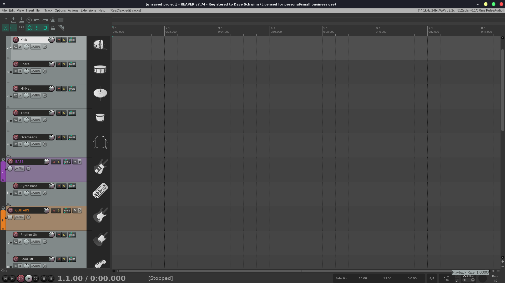

# ReaClaw — Trailers & Demos

Everything needed to produce an **audible, captioned trailer/demo video** of
ReaClaw driving REAPER, on the aarch64 Raspberry Pi test rig.

---

## CI smoke test (headless, no display, no video)

`scripts/ci_smoke_test.py` is the automated counterpart to the trailer scripts
below — issue #36's "productionize `demos/`" — and runs on every PR
(`.github/workflows/ci.yml`'s `e2e-render-smoke` job). It builds a tiny
composition via the API, renders it offline, and asserts the output is
non-silent via `GET /analysis/file` — no ffmpeg, no GUI, no realtime audio.
Run it locally against any running ReaClaw instance:

```bash
REACLAW_BASE=https://127.0.0.1:9091 REACLAW_KEY=sk_change_me \
  python3 demos/scripts/ci_smoke_test.py
```

---

## Short demo: track icons (no audio)



`scripts/icons_show.py` builds a **24-track full-production template** and gives
every track a fitting factory track icon — kick, snare, cymbal, bass, guitars,
piano, strings, horns, a vocal mic — grouped into six colour-coded folders. It
exercises the icon write path added in **#29** (`P_ICON` read/write +
`GET /state/track-icons` discovery) and creates all 24 tracks in a single
`POST /state/tracks` batch call.

This one is short and deterministic: no MIDI, no instruments, no recording. Just
start REAPER with ReaClaw on port 9091 and run it; the payoff is visual (open the
track panel — see the image above).

```bash
cd demos/scripts
python3 icons_show.py      # discovers icons, clears project, builds 24 tracks, verifies
```

It prints a readback table and exits non-zero if any icon failed to resolve
(`icon_not_found`). The icon set it draws from is whatever REAPER ships under
`{ResourcePath}/Data/track_icons` (91 icons on the stock install); the script
queries `GET /state/track-icons` first and warns about any it can't find.

---

## FX & Automation trailer

`scripts/show_fxauto.py` + `scripts/post_fxauto.py` (built 2026-07-08) — four
MIDI tracks (Drums, Bass, Pad, Lead), four different stock effects (ReaComp,
ReaXcomp, ReaDelay, ReaEQ), and every automation flavor the API exposes: an
FX-**parameter** envelope (the compressor's Threshold, watched live through
its floating plugin GUI as it plays), a built-in **track** envelope (Pan),
stepping through a plugin's factory presets, and a MIDI read → transform →
write beat. Output `trailer-fxauto-YYYY-MM-DD.mp4`, uploaded to Drive
`ReaClaw/` alongside the other dated trailers there.

```bash
cd demos/scripts
python3 show_fxauto.py prepare                                    # not recorded
DISP=:3 MON=reatrailer.monitor ./record.sh /tmp/raw_fxauto.mp4 &
REC=$!
python3 show_fxauto.py perform
kill -INT $REC
python3 post_fxauto.py                                            # -> ~/reaclaw_fxauto_trailer.mp4
```

Gotchas specific to this one (extends the zoom-trailer gotchas noted in the
scripts' docstrings and in project memory):

- **FX-parameter automation has no REST verb.** `GetFXEnvelope(track, fx,
  param, true)` (Lua) creates/arms it and `InsertEnvelopePoint` writes points
  directly onto it — verified live: REAPER draws the lane in the arrange
  immediately, no separate "show envelope" step needed. `lib.write_fx_param_envelope()` wraps this; there's no track-level analog to
  `write_automation()`'s REST path for FX params.
- **The `agent_slot` / raw-`slot` split is a hard invariant, not a guess**:
  every new track's auto-added disabled inline ReaEQ is always raw slot 0, so
  the first FX added (`ReaSynth`) always lands at slot 1 and the second
  (the track's real effect) always lands at slot 2. `prepare()` asserts this
  per track instead of trusting it silently.
- **A floating FX GUI genuinely reflects live automation.** Opening it with
  `TrackFX_Show(track, fx, 3)` (`lib.show_fx()`) *before* writing and playing
  the parameter envelope makes the on-screen fader visibly sweep in sync with
  the audio — a stronger shot than any camera move.
- **Stock Cockos plugins ship real factory presets**: ReaEQ 24, ReaComp 20,
  ReaXcomp 10, ReaDelay 9 (probed live via `GET .../fx/{slot}/preset` before
  scripting the preset-tour shot). `POST .../fx/{slot}/preset {"navigate":1}`
  steps through them and returns the real name each time.
- The audio loop length is fixed by `BPM`/`BARS`, not by the zoom trailer's
  `PACE` env var — shots that hold through a full automation sweep use raw
  `time.sleep(N * LOOP_LEN)` rather than `hold()`, so the visual dwell stays a
  whole number of musical loop cycles regardless of `PACE`.

---

## Stretch-marker timing-correction trailer

`scripts/show_stretch.py` + `scripts/post_stretch.py` (built 2026-07-10) —
real one-shot kick/snare/hi-hat samples (Sony ACID library, *Groove
Spectrum*, pulled from Drive), arranged into a "human" drum take with
deliberately loose kick/snare timing against a tight 8th-note hat reference,
then corrected onto the grid live using REAPER's **stretch markers** —
`SetTakeStretchMarker` + the native "snap to grid" action. No pitch shift,
no re-recording: the audio between markers is locally time-stretched so each
hit's real transient lands exactly on the beat. Output
`trailer-stretch-YYYY-MM-DD.mp4`, uploaded to Drive `ReaClaw/`.

```bash
cd demos/scripts
python3 show_stretch.py prepare                                   # not recorded
DISP=:3 MON=reatrailer.monitor ./record.sh /tmp/raw_stretch.mp4 &
REC=$!
python3 show_stretch.py perform
kill -INT $REC
python3 post_stretch.py                                           # -> ~/reaclaw_stretch_trailer.mp4
```

Gotchas specific to this one:

- **There is no REST verb for stretch markers at all** (same story as
  FX-parameter envelopes). `reaper.SetTakeStretchMarker(take, -1, pos)`
  appends one at a take-relative position (seconds from the start of the
  take's *source*, not the item's absolute project position — easy to get
  backwards). `lib.set_stretch_markers()` wraps the batch case.
- **41843 "Item: Add stretch markers at time selection" does NOT do
  per-transient detection on this build**, despite the name — verified live,
  it only drops two markers at the EDGES of the time selection. The actual
  automatic-detection primitive is native action `40836` ("move cursor to
  nearest transient in items"), which does real analysis; `lib.nearest_transient()` parks the edit cursor near an expected hit and lets REAPER
  snap it onto the true onset, then `41842` ("Add stretch marker at cursor")
  drops the marker there. That's the on-camera "REAPER finds the hit" beat;
  the remaining markers are placed in one batched call since their true
  onsets are already known (we authored the take).
- **`POST /state/items {"create":[{"track","position","file"}]}` is a real,
  direct REST verb for placing audio — no Lua/`InsertMedia` workaround
  needed** (that hack is `.mid`-only; see `insert_media()`). Placing 48
  one-shot hits was 2 batched HTTP calls, not 48.
- **Gluing several one-shot items into one continuous take is what makes
  stretch markers meaningful.** `lib.glue_track_items()` wraps native action
  `40362` ("glue items, ignoring time selection") — without gluing, "moving
  a marker" would just be moving separate items, which is plain quantize,
  not audio-only time-stretch.
- **41846 "Item: Snap stretch markers to grid" is the actual payoff** — one
  action call moves every marker on the selected item to the nearest grid
  line (set explicitly via `reaper.GetSetProjectGrid`, `lib.set_project_grid()`, rather than trusting whatever division the UI was last
  left on). Verified live: every take-relative marker position lands on an
  exact multiple of the beat length post-snap.

---

## Post-punk drum-anthem trailer

`scripts/show_postpunk.py` + `scripts/post_postpunk.py` + `scripts/gen_postpunk.py`
(built 2026-07-11) — drums in the school of **Stephen Morris** (Joy Division /
New Order) and **Kevin Haskins** (Bauhaus / Tones on Tail): the drums carry
the song instead of keeping time. Period-correct sampled hardware from Dave's
Drive audio library (`Audio Media Library/3rd Party/Drum Machine Samples`,
kb6.de archive): **Oberheim DMX** kick/snare/hats/clap/crash, **Simmons SDS5**
toms as a four-pad melodic voice, **Star Instruments Synare 3** answering the
snare. The bass is a Karplus-Strong plucked string synthesized offline by
`gen_postpunk.py` (two voices detuned ±0.12% ≈ a chorus pedal, octave-down
sine for body), one WAV per pitch in a note-filtered RS5K bank; cold detuned-saw
pads are placed as audio items. 48 bars, 138 BPM, E minor: 16th-note machine
kick intro → drums-only groove with the Simmons tom hook → driving-8ths bass
entry → tribal floor-tom/rim-clave turn → rebuild with the high bass hook →
motorik peak → machine outro with an octave-jumping 16th bass sequence.
Output `trailer-postpunk-YYYY-MM-DD.mp4` + `reaclaw-postpunk-YYYY-MM-DD.mp3/.wav`
mixdowns, uploaded to Drive `ReaClaw/`.

```bash
cd demos/scripts
python3 gen_postpunk.py             # synthesize bass/pad WAVs (once)
python3 show_postpunk.py probe      # dump FX param name->index maps (once)
python3 show_postpunk.py render     # offline render + LUFS/spectral check
DISP=:3 MON=reatrailer.monitor ./record.sh /tmp/raw_postpunk.mp4 &
REC=$!
python3 show_postpunk.py perform
kill -INT $REC
TRIM=11 python3 post_postpunk.py    # -> ~/reaclaw_postpunk_trailer.mp4
```

Gotchas specific to this one:

- **Several Cockos plugins expose TWO params named "Wet"** (ReaDelay 0 and 13,
  ReaVerbate 0 and 9, ReaComp 11 and 22 — the tap/mix wet vs. a global wet at
  the chain tail). A name→index map built naively from the probe keeps the
  *last* one and you end up turning down the wrong knob; the map in
  `/tmp/postpunk/fx_map.json` is patched after probing so "Wet" means the mix
  control (see `main()`'s probe note).
- **ReaDelay "1: Length (musical)" takes the note value directly as the
  normalized param**: `0.0625` = a 1/16-note slap — no ms math, and it tracks
  the project tempo. That one param is the whole Martin Hannett snare sound.
- The kb6 DMX samples are **IEEE-float WAVs** — RS5K and ffmpeg read them
  fine, but Python's stdlib `wave` module can't (use ffprobe when auditing).
- Mix iteration loop that worked: `render` mode → `GET /analysis/file` for
  LUFS/true-peak/spectral split, plus a local per-2-bar RMS/band script to
  verify each *section* of the arrangement has the energy profile it should
  (the tribal turn is 85% sub-200 Hz *on purpose*; the grooves needed a hats
  boost before the high band showed up at all).

---

The first trailer was built **2026-06-22** (output `~/trailer.mp4`, 1:40 long).
That file and its original scratchpad scripts have since been cleared. The
scripts in `scripts/` are **faithful reconstructions** from detailed build notes
— the logic and every hard-won gotcha are preserved, but expect to tweak a pacing
constant or a path on first run.

---

## TL;DR — how to make one

```bash
cd demos/scripts

# 0. Prereqs: REAPER running with ReaClaw loaded (port 9091), audio backend =
#    PulseAudio (NOT the silent jackd-dummy), HDMI sink active. See "Rig" below.

# 1. Frame the shot: minimize the terminal, maximize REAPER, park the mouse.
xdotool getactivewindow windowminimize                 # hide this terminal
wmctrl -a REAPER && wmctrl -r REAPER -b add,maximized_vert,maximized_horz
xdotool mousemove 1910 1070                             # park cursor in a corner

# 2. Start recording (blocks). Captures screen + REAL HDMI audio together.
./record.sh /tmp/raw.mp4 &
REC=$!

# 3. Run the choreography (builds the groove, plays it, shows off verbs).
python3 show.py

# 4. Stop recording cleanly (flushes the MP4 moov atom).
kill -INT $REC

# 5. Restore the terminal, then burn captions + title/end cards.
python3 post.py        # -> ~/trailer.mp4
```

---

## The rig (preconditions)

See the repo `CLAUDE.md` and the local-test-rig notes for full detail. The bits
that matter for a trailer:

| Thing | Value |
|---|---|
| REAPER | v7.74 linux-aarch64, `~/opt/REAPER` |
| ReaClaw server | `https://127.0.0.1:9091`, Bearer `sk_change_me`, self-signed TLS |
| **Audio backend** | **Prefs → Audio → Device → Audio system = PulseAudio** (the jackd-dummy used for headless API testing is SILENT) |
| Audio sink | HDMI-A-1 → PulseAudio `alsa_output.platform-107c701400.hdmi.hdmi-stereo`, default + unmuted |
| Capture audio from | that sink's **`.monitor`** source |
| GUI tools | `xdotool`, `wmctrl`, `ffmpeg` (with x11grab, libx264, drawtext, aac) |

Launch REAPER **detached** (not `&` in a foreground shell — the harness tears
down the process group and kills it; that's the recurring exit-144).

---

## Headless / monitor-off path (Xvfb + null sink) — PROVEN 2026-06-24

The physical-display path above only works when the HDMI **monitor is powered
on**. With the monitor off (or a truly headless box), the Pi's `vc4` KMS driver
has no output to scan out, so:
- **Video:** `x11grab` of `:0` returns solid black (`YAVG≈16`). VT-switching
  (`chvt`) and DPMS-disable do NOT fix it — there is simply no active CRTC.
- **Audio:** the HDMI PulseAudio sink can't clock samples to its `.monitor`, so
  capture is silent (−91 dB) even though the sink shows `State: RUNNING`.

The fix is to depend on **neither** the physical display nor the HDMI sink:

```bash
# 1. Virtual framebuffer + a window manager (software-rendered, always readable)
setsid bash -c 'Xvfb :3 -screen 0 1920x1080x24 -ac +extension RANDR &'
setsid bash -c 'DISPLAY=:3 xfwm4 &'

# 2. PulseAudio null sink (software clock — runs regardless of hardware)
pactl load-module module-null-sink sink_name=reatrailer \
      sink_properties=device.description=ReaTrailer

# 3. Launch REAPER on the virtual display (detached)
setsid bash -c 'DISPLAY=:3 ~/opt/REAPER/reaper -nosplash &'

# 4. Route REAPER's output into the null sink
SI=$(pactl list sink-inputs | awk '/Sink Input #/{id=$3}
     /application.name = "REAPER"/{print id}' | tr -d '#' | head -1)
pactl move-sink-input "$SI" reatrailer

# 5. Record against the virtual display + null-sink monitor
DISP=:3 MON=reatrailer.monitor ./record.sh /tmp/raw.mp4 &
python3 show.py
kill -INT %1            # finalize the mp4

# 6. Caption + cards
python3 post.py         # -> ~/trailer.mp4
```

`record.sh` honours `DISP` (X display) and `MON` (Pulse source) env vars exactly
for this. `xfwm4` is the only WM installed on the rig; it provides maximize so
the REAPER window fills 1920×1080.

**Two gotchas that cost real time here:**
- **Playback runs off the end.** `GetSetRepeat(1)` behaves like a *toggle* on
  this build, so it can leave repeat OFF and the cursor rolls past the content
  into silence (master meter −150 dB). `lib.set_loop_and_repeat()` now queries
  state and only flips when needed; `lib.play_from_start()` parks the cursor at 0.
  Verify with `GET /state/meters` → `master.peak_db` should be > −150 while playing.
- **ReaClaw logs to the ReaScript console window.** Console output is gated by
  `logging.level`; at `debug`/`info` every API call pops the console over your
  shot. Set `logging.level` to `warn` in `~/.config/REAPER/reaclaw/config.json`
  (restart REAPER) for the recording, then restore.

---

## Files

| File | Role |
|---|---|
| `scripts/smf.py` | Minimal Type-0 Standard MIDI File writer (no deps). The ONLY reliable way to get audible notes into this REAPER build. |
| `scripts/gen_groove.py` | Generates 7 per-track `.mid` stems (kick/bass/hats/snare/perc/pad/lead). |
| `scripts/lib.py` | ReaClaw REST client + REAPER choreography helpers (verified endpoints). |
| `scripts/show.py` | The choreography: build groove → loop → unmute layer-by-layer → tour verbs. Logs caption marks. |
| `scripts/record.sh` | ffmpeg screen + HDMI-monitor audio capture; writes record-start epoch. |
| `scripts/post.py` | Burns lower-third captions (aligned via marks) + title/end cards; concats. |
| `scripts/show_fxauto.py` | The FX & Automation trailer choreography (see section above). |
| `scripts/post_fxauto.py` | Same caption/card pipeline as `post.py`, retitled for the FX trailer. |
| `scripts/show_stretch.py` | The stretch-marker timing-correction trailer choreography (see section above). |
| `scripts/post_stretch.py` | Same caption/card pipeline as `post.py`, retitled for the stretch-marker trailer. |

---

## The hard-won knowledge (READ THIS before changing the scripts)

### Making REAPER actually make sound through ReaClaw
- `reaper.CreateNewMIDIItemInProject` is **nil** on this build.
- Inserting notes into a take built from `PCM_Source_CreateFromType("MIDI")`
  **fails silently**: `MIDI_GetPPQPosFromProjTime` returns `-1` (no valid PPQ
  map), `MIDI_InsertNote` returns false, notecount stays 0 → output is −91 dB.
- **Working route:** write a real **Type-0 `.mid`** file (see `smf.py`) and
  `reaper.InsertMedia(path, 0)` onto the selected track — after
  `SetOnlyTrackSelected` + `SetEditCurPos(0)`. `lib.insert_media()` does this.
- Confirmed audible: 1 ReaSynth track playing a `.mid` = −16 dB; the full
  7-track groove = −5 dB at the master.

### Instruments
- Add ReaSynth via the **structured endpoint** `POST /state/tracks/{i}/fx
  {name:"ReaSynth"}` (resolves to "VSTi: ReaSynth (Cockos)"). The Lua
  `TrackFX_AddByName("ReaSynth", …)` route did **not** add it.
- ReaSynth is the same sine for every instance — differentiate "instruments" by
  **pitch + note length** (low+short = kick/bass, high+short = hats).
- **Gain-stage every track down** (−5..−17 dB) via `volume_db` or the master
  clips at 0 dB.
- ReaSynth's one-sine limitation is now optional: **Surge XT**, **Nekobi**, and
  **Cardinal Synth** (default patch, no setup) all drop in and make sound
  immediately. **sfizz** is installed and its DSP engine is verified (real
  audio from real SFZ libraries via the CLI render tool), but loading a
  sample file *through the REAPER plugin GUI* is blocked on this Xvfb rig by
  an environment GTK issue — see the plugin cheat sheet in
  `skill/reaclaw/SKILL.md` for API names and gotchas (issue #62).

### Playback / the build-up effect
- Loop: `GetSet_LoopTimeRange(true,false,0,len,false)` + `GetSetRepeat(1)`
  (`lib.set_loop_and_repeat`).
- Build-up: create all tracks **muted**, `act(1007)` to play, then unmute
  layer-by-layer on bar boundaries (`POST /state/tracks/{i} {muted:false}`).

### Automation
- The envelope must be **active first**: `act(40406)` (Volume) / `act(40407)`
  (Pan) on the *selected* track, THEN
  `POST /state/tracks/{i}/automation {envelope:"Volume", points:[…]}`.
  Otherwise you get **400 "Envelope not found"**.

### Camera moves (action ids)
- `1012` = zoom **IN** horizontal, `1011` = zoom **OUT** horizontal
  (the labels are swapped from intuition — don't trust the names).
- `40031` = zoom to time selection. `40111`/`40112` = taller/shorter tracks.
- Piano roll: select one item + `act(40153)`, then
  `wmctrl -r "MIDI take" -b add,maximized…`; close with `wmctrl -c "MIDI take"`.
- Tempo map: `POST /state/tempo {time, bpm}`.

### Capturing the audio
- `ffmpeg -f pulse -i alsa_output.platform-107c701400.hdmi.hdmi-stereo.monitor`
  muxed with `x11grab`. Measure level with `-af volumedetect`.

### Caption alignment
- `record.sh` writes the record-start epoch to `/tmp/rec_start.txt`.
- `show.py` logs `epoch <TAB> label` per step to `/tmp/marks.txt` via `lib.mark()`.
- `post.py` subtracts record-start (and any head TRIM) to get video-time offsets
  for `drawtext … enable='between(t,S,E)'` lower-thirds.
- Title/end cards are lavfi `color=` video + `anullsrc` audio, encoded with
  **identical params** to the body so the final concat can use `-c copy`.

---

## Verified ReaClaw endpoints used here

| Endpoint | Body | Notes |
|---|---|---|
| `POST /execute/action` | `{"id": <int\|str>}` | run any REAPER command / named action |
| `POST /scripts/register` | `{"name", "script"}` → `{"action_id"}` | register one-shot Lua |
| `DELETE /scripts/{action_id}` | — | unregister it |
| `POST /state/tracks` | `{"create":[{name,volume_db,muted}]}` | returns `created[].index` |
| `POST /state/tracks/{i}` | `{volume_db,pan,muted,name,…}` | per-track update |
| `POST /state/tracks/{i}/fx` | `{"name":"ReaSynth"}` | add instrument/FX |
| `POST /state/tracks/{i}/automation` | `{"envelope","points":[{time,value}]}` | arm envelope first |
| `POST /state/items` | `{"create":[{track,position,file,…}]}` | place an audio/MIDI item directly, no Lua |
| `POST /state/tempo` | `{"time","bpm"}` | tempo/timesig marker |

(Confirmed against `src/handlers/` + `src/server/router.cpp` at reconstruction
time. If an endpoint changes, update `lib.py` and this table together.)

---

## Known weak spots in the reconstruction

- **Pacing** (`SECONDS_PER_BAR`, `CAPTION_HOLD`, sleeps in `show.py`) is a guess
  tuned for 120 BPM / 4-bar loops. Watch the first cut and adjust.
- **Window-title strings** for `wmctrl` (piano-roll "MIDI take") vary by REAPER
  build/locale — verify with `wmctrl -l` before scripting window moves.
- **Font path** in `post.py` assumes DejaVu; change `FONT` if missing.
- `post.py`'s `-c copy` concat needs all three clips at the exact same
  resolution/fps/codec — keep the `VENC`/`AENC`/`SIZE` constants in sync with
  `record.sh`.
